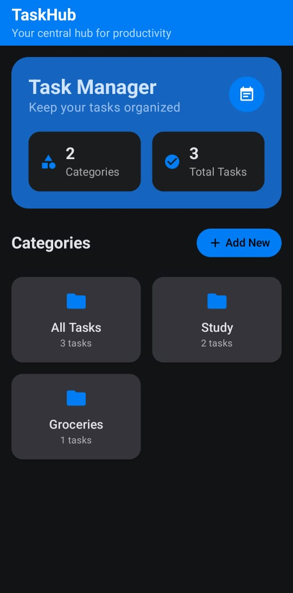
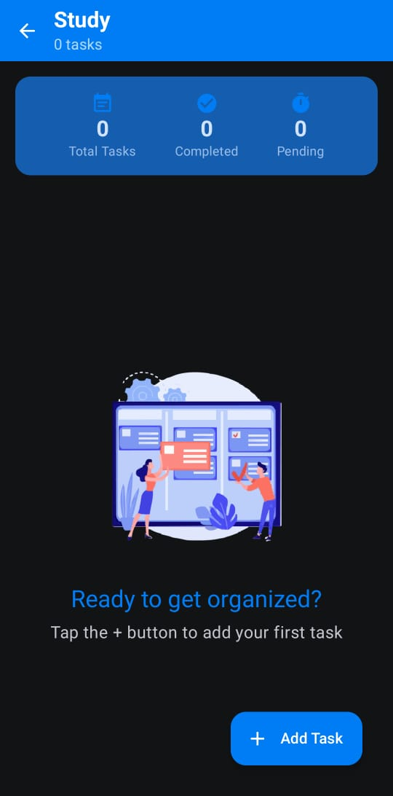
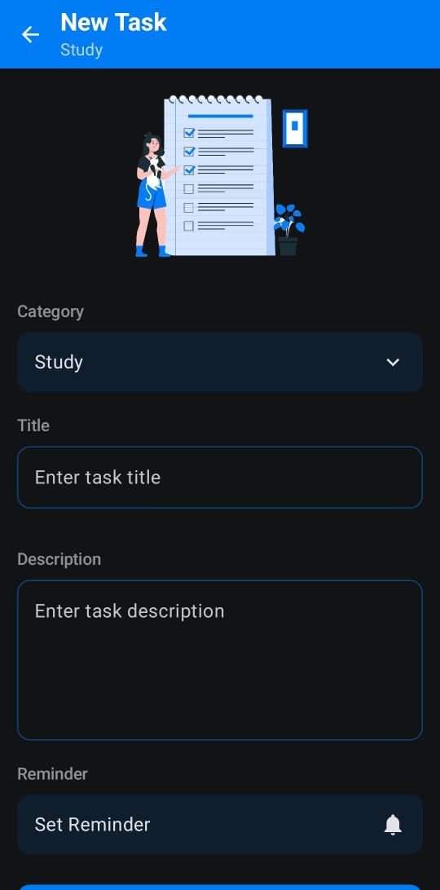
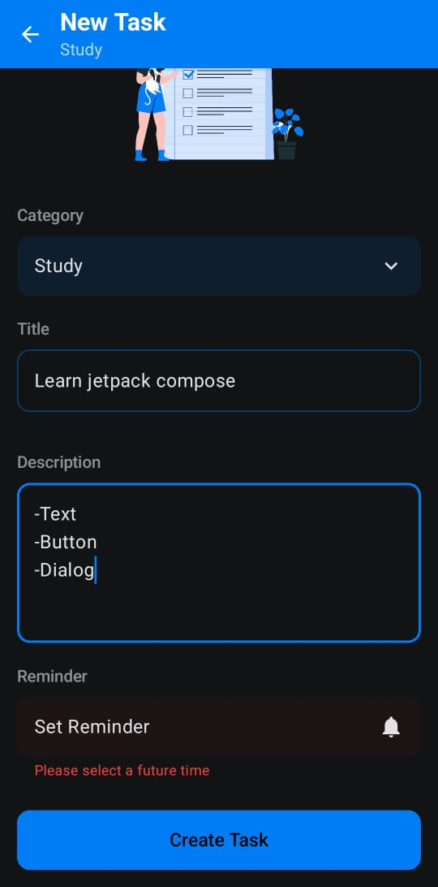
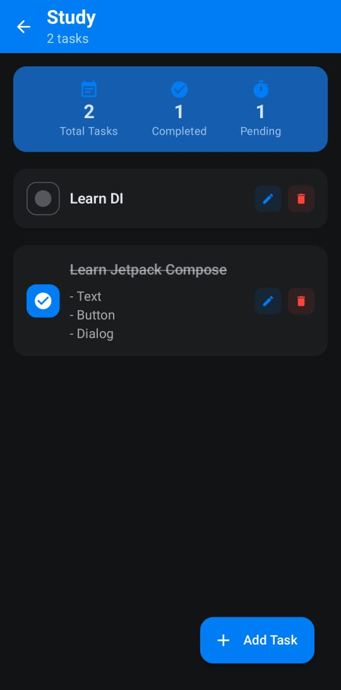
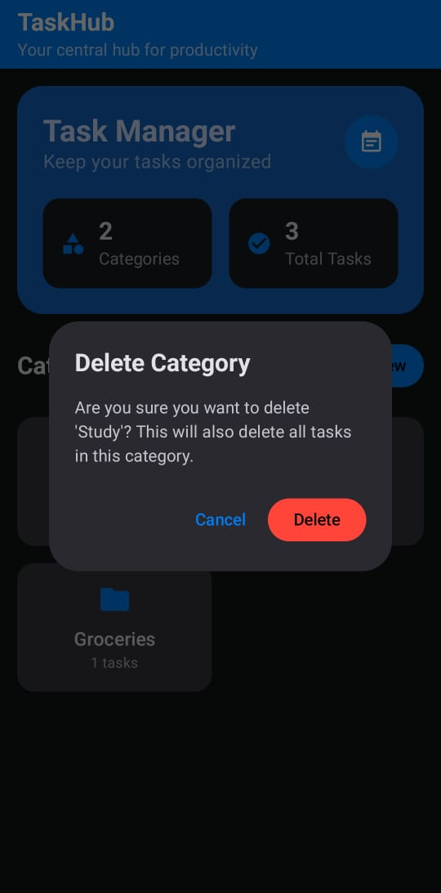

# 📅 **TaskHub App**

TaskHub is a comprehensive task management application designed to help users efficiently organize and monitor their daily activities. Developed with Kotlin and Jetpack Compose, it offers a user-friendly interface for seamless task handling. It also provides insightful statistics about the tasks for better productivity tracking.

## 🚀 **Key Highlights**

- **Jetpack Compose**
- **Hilt for Dependency Injection (DI)**:
- **Room for Data Persistence**:
- **BroadcastReceiver to Trigger Notifications**

## 🛠️ **Core Features**
- **📂 Category Management**: Create and delete categories to effectively organize tasks.
- **✅ Task Management**: Add, edit, and remove tasks with detailed information.
- **🛡️ Form Validation**: Ensures data integrity by validating task inputs.
- **⏰ Reminders**: Set reminders for tasks to ensure important events or activities are not overlooked.
- **🎨 Compose Dialogs**: Interactive dialogs for confirmations, alerts, and other user interactions, built with Jetpack Compose.

## 📸 **Screenshots**

<table>
  <tr>
    <td></td>
    <td width="20"></td>
    <td></td>
    <td width="20"></td>
    <td></td>
  </tr>
</table>

<table>
  <tr height="40"></tr>
</table>

<table align="center">
  <tr>
    <td></td>
    <td width="20"></td>
    <td></td>
    <td width="20"></td>
    <td></td>
  </tr>
</table>
